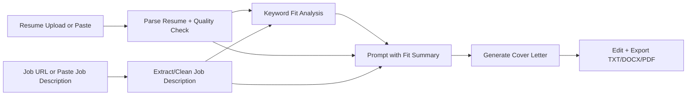

# AI Cover Letter Generator

A Streamlit application that creates editable, job-specific cover letters from a resume and job description. The app parses PDF/DOCX resumes, accepts job URLs or pasted job descriptions, previews keyword match, and exports the final cover letter as TXT, DOCX, or PDF.

**Live Demo:** https://cover-letter-generator-ai.streamlit.app  
**GitHub:** https://github.com/aakanksha105/ai-cover-letter-generator

---

## What it does

- Reads a PDF/DOCX resume or accepts pasted resume text.
- Warns when resume extraction looks short or unreliable.
- Fetches job descriptions from URLs when possible.
- Supports manual job-description paste when job boards block extraction.
- Shows matched skills, missing skills, important requirement lines, and recommended emphasis.
- Sends the resume, job description, and keyword-fit summary into the cover-letter prompt.
- Generates a cover letter in two styles: **Professional** or **Modern**.
- Supports three lengths: **Short**, **Medium**, and **Detailed**.
- Lets users edit the generated letter before exporting.
- Exports TXT, DOCX, and PDF.
- Optionally adds a clean contact header to DOCX/PDF exports.

---

## Tech Stack

| Area | Tools |
|---|---|
| UI | Streamlit, custom CSS |
| LLM | OpenAI API, LangChain |
| Resume parsing | pypdf, python-docx |
| Job extraction | Playwright, requests, BeautifulSoup, trafilatura, JSON-LD parsing |
| Keyword analysis | Python, regex, curated skill catalog, LLM skill extraction |
| Export | python-docx, ReportLab |
| Testing | pytest |
| Packaging | Poetry, Docker |

---

## Architecture



---

## Project Structure

```text
ai-cover-letter-generator/
├── app.py
├── agents/
│   ├── __init__.py
│   └── openai_client.py
├── prompts/
│   ├── __init__.py
│   ├── cover_letter_prompts.py
│   └── job_listing_prompt.py
├── utils/
│   ├── __init__.py
│   └── utils.py
├── tests/
│   ├── conftest.py
│   ├── test_app_helpers.py
│   ├── test_exports_and_prompts.py
│   ├── test_fit_analysis.py
│   ├── test_job_extraction.py
│   └── test_resume_parsing.py
├── assets/
├── .env.example
├── requirements.txt
├── pyproject.toml
├── poetry.lock
├── Dockerfile
├── docker-compose.yml
├── DEPLOYMENT.md
└── README.md
```

---

## Environment Setup

Copy the example environment file:

```bash
cp .env.example .env
```

Then add your OpenAI API key:

```env
OPENAI_API_KEY=your_key_here
OPENAI_MODEL=gpt-4o-mini
USER_AGENT=AI-Cover-Letter-Generator/1.0
```

Do **not** commit your real `.env` file.

---

## Run Locally with Poetry

```bash
poetry install
poetry run playwright install chromium
poetry run streamlit run app.py
```

Then open:

```text
http://localhost:8501
```

---

## Run Locally with pip

```bash
python3 -m venv .venv
source .venv/bin/activate
pip install --upgrade pip
pip install -r requirements.txt
python -m playwright install chromium
streamlit run app.py
```

---

## Run Tests

```bash
poetry run pytest
```

Current test suite:

```text
23 passed
```

The tests cover:

- App helper functions
- Resume parsing
- Pasted resume normalization
- Resume extraction quality warnings
- Keyword matching and false-positive avoidance
- Requirement-line extraction
- Job description extraction helpers
- Prompt formatting with fit summary and generation options
- Contact-detail extraction for export headers
- DOCX/PDF export generation
- DOCX/PDF professional header formatting
- Closing/signature formatting

---

## Docker

Docker is optional. The app can run locally with Poetry or pip without Docker.

Use Docker if you want a reproducible environment with Playwright/Chromium included:

```bash
docker build -t coverai .
docker run --env-file .env -p 8501:8501 coverai
```

Or with Docker Compose:

```bash
docker compose up --build
```

Then open:

```text
http://localhost:8501
```

---

## Deployment

This project is deployed on Streamlit Community Cloud.

For Streamlit Cloud deployment:

1. Push this project to GitHub.
2. Create a Streamlit Cloud app.
3. Select this repository.
4. Set the main file path to:

```text
app.py
```

5. Add these secrets/environment variables:

```toml
OPENAI_API_KEY = "your_key_here"
OPENAI_MODEL = "gpt-4o-mini"
USER_AGENT = "AI-Cover-Letter-Generator/1.0"
```

6. Deploy the app.

---

## How to Use

1. Open the app.
2. Go to **Create Cover Letter**.
3. Upload a resume or paste resume text.
4. Review the extracted resume text if needed.
5. Paste a job description or fetch it from a URL.
6. Preview keyword match.
7. Choose style and length.
8. Generate the cover letter.
9. Edit the result.
10. Download the final version as TXT, DOCX, or PDF.

---

## Cover Letter Export Format

For DOCX/PDF exports, the optional contact header uses a modern online-application format:

```text
Candidate Name
Email | Phone | LinkedIn | Portfolio/GitHub

Date
Company — Job Title

Dear Hiring Manager,

...

Sincerely,
Candidate Name
```

A street address is intentionally not included because most modern online tech applications do not require one.

---

## Known Limitations

- Some job boards block automated URL extraction. Paste the job description manually if fetch results are incomplete.
- Scanned/image-only PDFs may not parse correctly without OCR.
- Multi-column or highly designed resumes may require manual paste review.
- Generated letters should always be reviewed before submission.
- The app does not submit job applications automatically.
- The app does not use database storage in this version.

---

## Future Improvements

- OCR support for scanned resumes.
- Structured JSON parsing for resume and job fields before generation.
- Streaming generation output.
- Optional saved history with user-controlled storage.
- End-to-end UI tests with Playwright.

---

## Resume / Portfolio Summary

**CoverAI — AI Cover Letter Assistant**  
Built a Streamlit app using Python, OpenAI/LangChain, PDF/DOCX parsing, job-description extraction, keyword-fit analysis, and DOCX/PDF export to generate editable, resume-aware cover letters.

---

## Author

**Aakanksha Bhondve**  
MS Computer Science, Binghamton University  
GitHub: https://github.com/aakanksha105  
LinkedIn: https://www.linkedin.com/in/aakanksha-bhondve

---

## License

This project is licensed under the MIT License.
